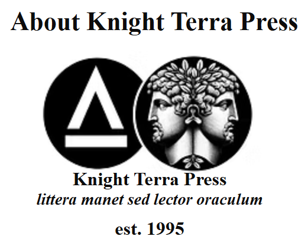
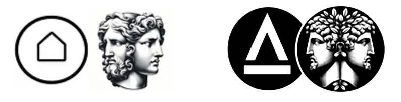

Knight Terra Press was founded as a private press in 1995, some four years after [the Founder](./QuinnJackson_CV.pdf), then a Voting Member of the Freelance Editors' Association of Canada, served the West Coast writing community as a literary agent. The press launched with the digital publication of the poststructuralist novella *The last breath of a Kurdish village*. This was followed by the publication of pattern matching and mathematical expression evaluation software implemented in C++. The C++ publications became the foundation upon which he built a career in software research and development, and eventually led to his formal work in the mathematical formalisms of adaptive grammar. Shortly thereafter, the Press became inactive. From 2005 to 2006, the Press awoke and published up-and-coming authors’ novels under the paper imprint Chevalier Editions. While this imprint did well in its short run, it was again put aside as [the Press Founder](./QuinnJackson_CV.pdf) stepped into his Satori in 2007.

Knight Terra Press returned on the release of *Midnight at the Arcanum: a monograph* in November 2023, a work that encapsulates the full arc of an artistic life journey in the many years since its founding. With its responsive multi-pass process of independent outside peer and reader review, Knight Terra Press commits itself to the ideal that even though the text becomes set upon publication, the reader-driven interpretation of the text is ever-evolving.

The Press’s motto, *littera manet sed lector oraculum*, captures this sentiment:

> the text is set but the reader is oracle

As a private initiative, Knight Terra Press remains steadfast in its long commitment to its ideological journey over material gains, offering a platform for works that provoke thought, ignite imagination, and perhaps inspire positive local change.

**About the Colophon**

The left half of of the Knight Terra Press colophon is composed of a highly stylized House-in-Circle, an esoteric symbol denoting the attunement of the single individual to the infinite, sometimes expressed as The Self in Tune with the Infinite, as captured in the Hermetic Axiom: όπως επάνω, έτσι και κάτω (As above, so below).​​​​​

The lambda (λ) symbol has many meanings, but here signifies the empty string, that special string which contains no letters but also is not null: I am. In capitalizing λ to Λ, we are differentiating the set of all such lambda strings:

> We are.

Together with the bar, this forms the House-in-Circle, the Collective Self’s connection with the Infinite. Here, the Self is used in an inclusive sense, and thus the capitalization of lambda.

The right half of the colophon shows Janus, the Roman god who looks simultaneously into the past and future: a god of doorways, beginnings, endings, and change. This may be understood in Janus’ conceptual connection to midnight, that acme transformative turning-point moment at the flickering, luminous liminal of yesterday and today, where we are fully in the moment of the here and now, mindful of what came before, while staring into the promise of what we may yet today become.
